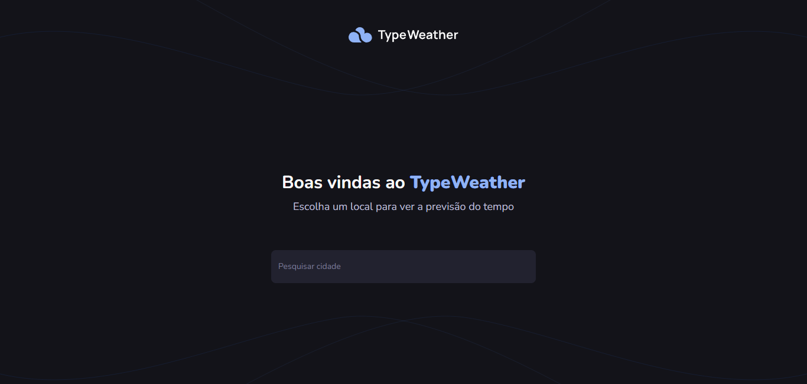
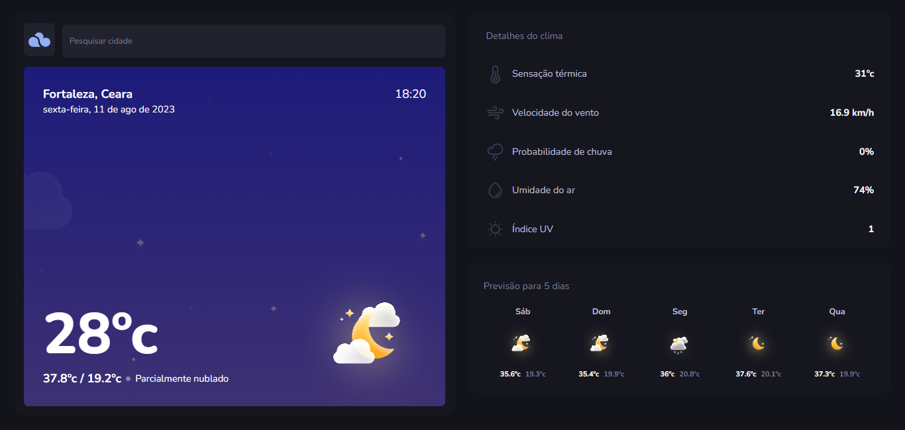

# TypeWeather

It is an application to view the weather forecast in different cities around the world!


## Screenshots




## 🚀 Techs

- Next.js 13
- Tailwindcss
- Typescript
- SWR

## Environment Variables

To run this project, you will need to add the following environment variables to your .env file

`WEATHER_API`

`API_URL`

`NEXT_PUBLIC_API_URL`


## Run Locally

Clone the project

```bash
  git clone https://github.com/gleysonabreu/typeweather.git
```

Go to the project directory

```bash
  cd typeweather
```

Install dependencies

```bash
  npm install
```

Start the server

```bash
  npm run dev
```

